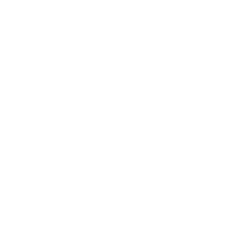

   

# Peer2Learn

Aplicativo gamificado e multi-plataforma, com o propósito de incentivar o sistema de aprendizgem peer-to-peer nas escolas de ensino fundamental.

## Sobre o Projeto

Peer2Learn foi desenvolvido com o kit de desenvolvimento Flutter, trazendo grande portabilidade entre plataformas. E distribuído através da ferramenta de deploy do Microsoft Azure.
## 

### HACKATHON CPBR14 - DESAFIO MICROSOFT

- Tema: "Educação – Inovações que transformem a forma de aprender dos estudantes."
- 
- Vídeo Pitch
- Vídeo Demo
- Link da Solução

Desenvolvedores: João Vitor Sant' Anna, Maria Eduarda Dionisio, Fabricio Esper, Luiz Lima e Felipe Cunha.
